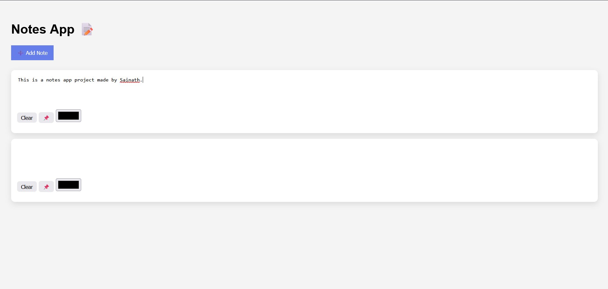

# 📝 Notes App

A clean and responsive **Notes App** built using **HTML, CSS, and JavaScript**. This application allows users to create, edit, organize, and personalize notes with an intuitive interface designed for quick note-taking.

---

## 🚀 Live Demo

🔗 https://your-live-demo-link.com

---

## 📸 Preview



---

## ✨ Features

* 📝 Create unlimited notes
* ✏️ Edit notes in real time
* 📌 Pin important notes
* 🧹 Clear note content
* 🎨 Change note background color
* 📋 Multiple note support
* ⚡ Fast and user-friendly interface
* 📱 Fully responsive design

> *(If you implemented Local Storage, add this feature)*

* 💾 Automatically saves notes using Local Storage

---

## 🛠️ Built With

* HTML5
* CSS3
* JavaScript (ES6)

---

## 📂 Project Structure

```text
Notes-App/
│
├── index.html
├── style.css
├── script.js
├── screenshot.png
└── README.md
```

---

## 🧠 What I Learned

This project helped me strengthen my knowledge of:

* DOM Manipulation
* Event Handling
* Dynamic Element Creation
* JavaScript Objects & Arrays
* Editable Content (`contenteditable`)
* Local Storage (if implemented)
* CSS Flexbox
* Responsive Web Design

---

## ▶️ Getting Started

1. Clone the repository

```bash
https://github.com/sairaj-086/notes-app
```

2. Open the project folder.

3. Open **index.html** in your browser.

---

## 📌 Key Functionalities

✔ Create Notes

✔ Edit Notes

✔ Pin Important Notes

✔ Clear Notes

✔ Change Note Colors

✔ Multiple Notes Support

✔ Responsive UI

> *(If applicable)*

✔ Local Storage

---

## 🚀 Future Improvements

* 🔍 Search Notes
* 🏷️ Categories & Tags
* 📂 Archive Notes
* ⭐ Favorite Notes
* 📅 Date & Time Stamps
* 📄 Export Notes
* 🌙 Dark Mode
* ☁️ Cloud Sync

---

## 👨‍💻 Author

**Sairaj**

Feel free to explore the project, suggest improvements, or contribute.

If you like this project, don't forget to ⭐ the repository!

